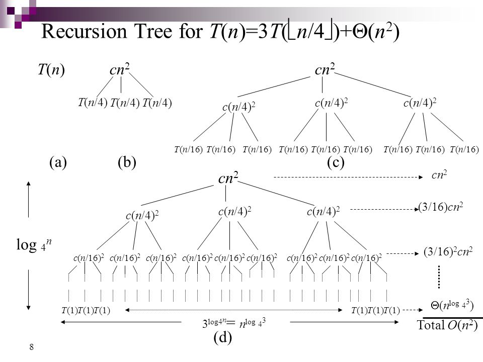

# Divide and Conquer

* __Divide__ the problem into a number of subproblems that are smaller instances of the same problem.
* __Conquer__ the subproblems by solving them recursively. If the subproblems sizes are small enough, however, just solve the subproblems in a straigtforward manner.
* __Combine__ the solutions to the subproblems into the solution for the original problem.

Divide-and-conquer is a technique for designing algorithms.

## Recurrences

A __recurrence__ is an equation or inequality that describes a function in terms of its value on smaller inputs.

They give us a natural way to characterize the running times of divide-and-conquer lgorithms.

For example, the _Merge Sort_ algorithm worst case running time T(n):

```
T(n) = Theta(1) if n = 1
T(n) = 2T(n/2) + Theta(n) if n > 1
```

### Example: Maximum-Subarray Problem

Check [this example](./maximum-subarray) to see first-hand how Divide and Conquer help us solve a particular problem.

## Solving Recurrences

* __Substitution method__, we guess a bound and then use mathematical induction to prove our guess correct.
* __Recursion-tree method__, converts the recurrence into a tree whose nodes represent the costs incurred at various levels of the recursion. We use techniques for boundings summations to solve the recurrence.
* __Master method__ provides bounds for recurrences of the form `T(n) = aT(n/b) + f(n)` where `a >= 1 && b > 1`.

---

### Substitution Method

1. Guess the form of the slution
2. Use mathematical induction to find the constants and show that the solution works.

As an example, let us determine an uper bound on the recurrence `T(n) = 2T(|n/2|) + n`.

We guess the soluton is `T(n) = O(n log n)`. The substitution method requires us to prove that `T(n) <= cn lg n` for an appropriate choice of the constant `c > 0`. We start by assuming this bound holds for all possitive `m < n`, in particular `m = |n/2|`, yielding `T(|n/2|) <= c |n/2| lg (|n/2|)`.

Substituting into the recurrence yields:

```
T(n) <= 2 (c |n/2| lg (|n/2|)) + n
	 <= cn lg (n/2) + n
	 = cn lg n - cn lg 2 + n
	 = cn lg n - cn + n
	 <= cn lg n (as long as c >= 1)
```

#### Avoiding pitfalls

We can falsely "prove" `T(n) = O(n)` by guessing `T(n) <= cn` and then arguing since `n` is a constant:

```
T(n) <= 2(c |n/2|) + n
	 <= cn + n
	 = O(n) WRONG!
```

The error is that we have not proved the exact form of the inductive hypothesis, that is, `T(n) <= cn`. We therefore will explicitly prove that `T(n) <= cn` when we want to show that `T(n) = O(n)`.

#### Changing variables

Sometimes a little algebraic manipulation can make an aunknown recurrence simialr to one you have seen before. Consider the following example.

```
T(n) = 2T(|sqrt(n)|) + lg n
```

It looks difficult. But with a little change of variables... Renaiming `m = lg n` yields:

```
T(2^m) = 2T(2^(m/2)) + m.
```

We can now rename `S(m) = T(2^m)` to produce the new recurrence:

```
S(m) = 2S(m/2) + m
```

Which is very much like common recurrences `S(m) = O(m lg m)`. Changing back from `S(m)` to `T(n)` we obtain:

`T(n) = O(lg(n) lg(lg(n)))

### Recursion Tree Metod

Each node represents the cost of a single suproblem somewhere in the set of recursive function invocations. We sum the costs within each level of the tree to obtain a set of per-level costs, and then we summ all to determine te total cost.

A recursion tree is best used to generate a good guess, which you can later verify with the _Substitution Method_.



### Master Method

Provides a cookbook method for solving recurrences of the form:

```
T(n) = aT(n/b) + f(n)

a >= 1 && b > 1, are constants.
```

#### Master Theorem

Let a >= 1 and b > 1 be constants, let f(n) be a function nd let T() be defined on the nonnegative integers by the recurrence `T(n) = aT(n/b) + f(n)`, then T(n) has the followign asymptotic bounds:

1. If `f(n) = O(n^(lob_b(a-e)))` for some constant `e > 0` then `T(n) = Theta(n^log_b(a))`.
2. If `f(n) = Theta(n^log_b(a))`, then `T(n) = Theta(n^log_b(a) * lg n)`.
3. If `f(n) = Mu(n^log_b(a+e))`, for some constant `e > 0` then `T(n) = Theta(f(n))`.
