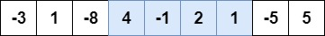

# Maximum-subarray problem

The maximum subarray problem is a task to find the series of contiguous elements with the maximum sum in any given array.

For instance, in the below array, the highlighted subarray has the maximum sum(6):



### Divide and Conquer Solution

We don't want an algoritm with O(n^2) as it would result if we try to resolve this by brute-force, trying every posible combination.

Let us consider the variation in every index.

Divide-and-conquer suggest we divide the subarray into two subarray of as equal size as possible. That is, we find the midpoint.

We know that any contiguous subarray A[i...j] of A[low...high] must lie in exactly one of the following places:

* Entirely in the subarray A[low..mid], so that low <= i <= j <= mid;
* Entirely in the subarray A[mid+1..high] so that mid < i <= j <= high
* Crossing the midpoint A[mid+1..high] so that low <= i <= mid < j <= high.

Therefore, a maximum subarray of A[low..high] must lie in exactly one of thse places. We can find maximum subarrays of A[low..mid] and A[mid+1..high] recursively, because these two subproblems are smaller instances of he problem of finding a maximum subarray.

#### `FIND-MAX-CROSSING-SUBARRAY(A, low, mid, high)`

```
left-sum = -infinity
sum = 0;
for i = mid downto low
	sum = sum + A[i]
	if sum > left-sum
		left-sum = sum
		max-left = i
right-sum = -infinity
sum = 0
for j = mid + 1 to high
	sum = sum + A[j]
	if sum > right-sum
		right-sum = sum
		max-right = j
return (max-left, max-right, left-sum + right-sum)
```

#### `FIND-MAXIMUM-SUBARRAY(A, low, high)`

```
if high == low
	return (low, high, A[low]) .. base case: only one element
else 
	mid = |(low+high)/2|
	(left-low, left-high, left-sum) = FIND-MAXIMUM-SUBARRAY(A,low,mid)
	(right-low, right-high, right-sum) = FIND-MAXIMUM-SUBARRAY(A, mid+1,high)
	(cross-low, cross-high, cross-sum) = FIND-MAX-CROSSING-SUBARRAY(A, low, mid, high)
	if (left-sum >= right-sum and left-sum >= cross-sum)
		return (left-low, left-high, left-sum)
	else if (right-sum >= left-sum and right-sum >= cross-sum)
		return (right-low, right-high, right-sum)
	else return (cross-low, cross-high, cross-sum)
```

### Analysis

Each subproblem is on a subarray of n/2 elements. And so we spend `T(n/2)` time solving each of them. Finding the max-crossing-subarray takes `Theta(n)` and the last comparisions to return the "combine" the solutions and decide whih resulting subarray is maximum takes `Theta(1)`.

Se we have the following recurrence:

```
T(n) = Theta(1), if n = 1
T(n) = 2T(n/2) + Theta(n), if n > 1
```
