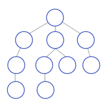

# Depth-first Search

Algorithm for traversing or searching tree or graph data structures. The algorithm starts at the root node (selecting some arbitrary node as the root node in case of a graph) and explores as far as possible along each branch before _backtracking_.



#### Pseudocode

```
all nodes initially unexplored
    mark s as explored
    for every edge (s, v):
        if v unexplored:
            DFS(G, v)``
```
