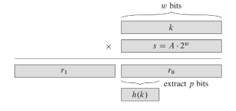

# Multiplication Method

First, we multiply the key `k` by a constant `A` in the range 0 < A < 1, and exactry the fractional part of `k A`.

Then, we multiply this value by `m` and take the floor of the result.

```
h(k) = |m (k A mod 1)|

Where ka Mod 1 means the frational part of k A, that is, k A - |k A|
```


