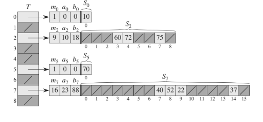

# Perfect Hashing
 
Hashing can provide excellent worst-case performance when the set of keys is __static__:

Once the keys are stored in the table, the set of keys never changes.

Some applications naturally have static sets of keys, for example a set of reserved words in a proramming languages, or filenames on a CD-ROM.

#### Definition

We call a hashing technique __perfect hashing__ if O(1) memory accesses are required to eprfom a search in the worst case.

#### How

To create a perfect hashing scheme, we use two levels of hashing, with univeral hashing at each level.

First level is essentially the same as for hashing with chaining: we hash the n keys into m slots using a hash function h carefully selected from a family of universal hash functions.

Instead of making a linked list of the keys hashing to slot j, however, we use a small __secondary hash table S_j__ with an associated hash function h_j. By chossing the function h_j carefuly, we can guarantee that there are no collisions at the secondary level.

In order to guarantee that there are no collisions at the secondary level, however, we will need to let the size m_j of hash table S_j be the square of number n_j of keys hashing to slot j. By chosing the first-level hash function well, we can limit the expected total amount of spaced used to O(n).
