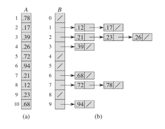

# Bucket Sort


| Algorithm      | Worst time | Average time | Space |
|----------------|------------|--------------|-------|
| Bucket sort    | O(n^2)     | O(n+n^2/k+k) | O(n * k) |

> Where k is the number of buckets. Then average time is O(n) when k is approximately n.


Bucket sort or _Bin Sort_ it's a __distribution sort__, works by distributing the elements of an array into a number of buckets. Each bucket is then sorted individually, either using a different sorting algorithm, or by recursively applying the sorting algorithm.

### Algorithm

Bucket sort assumes that the input is generated by a random process that distributes elements unfiormly and independently over the interval [0, 1).

Bucket sort divides the interal [0, 1) into n equal-sized subintervals (buckets) and then distributes the n input elements into the buckets. We don't expect many numbers to fall into each bucket.

To produce the output, we simple sort the numbers in each bucket and then go through the buckets in order.

### Example

Our example assumes that the input is an n-element array A and that each element A[i] in the array satisfies `0 <= A[i] < 1`. The codes requies an auxiliary array B[0.., n-1] of linked lists (buckets) and asusmes that there is a mechanism for maintaining such lists.



```
BUCKET-SORT(A)
let B[0..n-1] be a new array
n = A.length
for i = 0 to n-1
	make B[i] an empty list
for i = 0 to n-1
	insert A[i] into B[|n A[i]|]
for i = 0 to n-1
	sort list B[i] with insertion sort
concatenate lists B[0]...B[n-1] together in order
```
