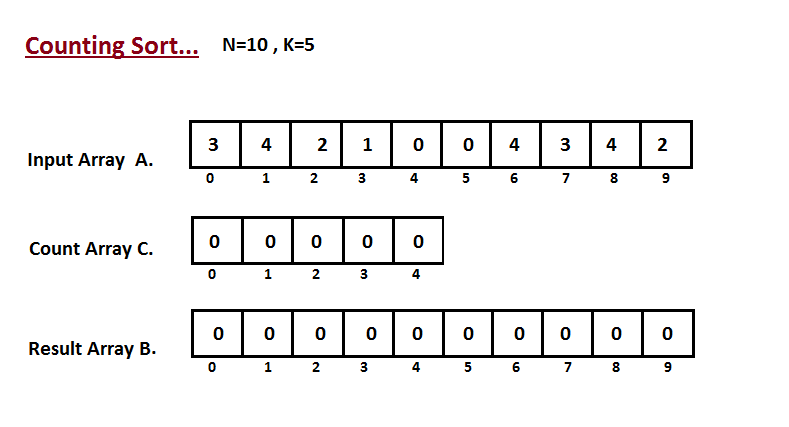

# Counting Sort

| Algorithm      | Worst time | Average time | Space |
|----------------|------------|--------------|-------|
| Counting sort	 | O(n + k)   | O(n + k)     | O(n + k) | 

Algorithm for sorting a collection of objects according to keys that are integers (_Integer Sorting Algorithm_). It operates counting the number of objects that have each distinct key value, and using arithmetic on those counts to determine the position of each key vlaue in the output sequence.

Its running time is linear in the number of items and the difference between the maximum and minimum key values, so it is only suitable for direct use in situations where the variations in keys is not significantly greater than the number of items.

It is often used as a subroutine in another sorting algorithm, radix sort for example, that can handle larger keys mor efficiently.
