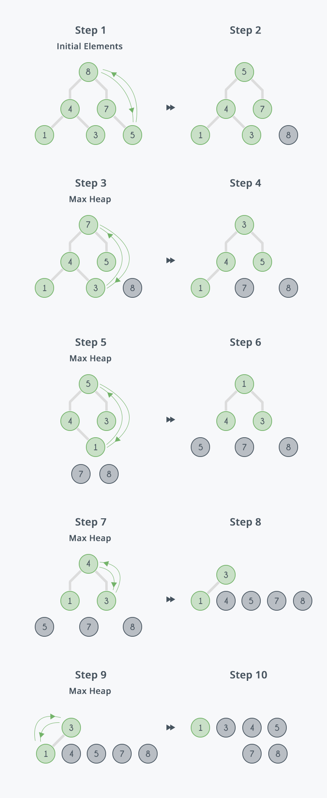

# Heap Sort

| Algorithm      | Worst time | Average time | Space |
|----------------|------------|--------------|-------|
| Heap sort      | O(n lg n)  | O(n lg n)    | O(n)  |



Heap sort is a comparison-based sorting algoritm. Can be though of as an improved selection sort. It divides its input into a sorted and an unsorted region, and it iteratively shrinks the unsorted region by extracting the largest element from it and insertion it into the sorted region.

Unlinke selection sort, heapsort does not waste time with a linear-time scan of the unsorted region, rather, a heap sort maintains the unsorted region in a heap data structure to more quickly find the largest element in each step.

Heapsort is an __in-place algorithm__ but it is __not a stable sort__.

## Importance of heapsort

It's fast as Merge Sort O(n lg n) and sorts in place like Insertion Sort, thus, Heap Sort combines the better attributes of the two.

Also, Heap Sort introduces an algorithm design technique: using a data structure to manage information.

## Algorithm

1. call the `heapify()` function on the list, to build from a list in O(n) operations, a max heap.
2. Swap the first element of the list with the final element. Decrease the considered range of the list by one.
3. Call the `siftDown()` function on the lsit ot sift the new first element to its appropriate index in the heap.
4. Repeat from step 2 until the considered range of the list is one element 

```
HeapSort(A)
	Build-Max-Heap(A)
	for i = A.length downto 2
		exchange A[1] with A[i]
		A.heap-size = A.heap-size -1
		Max-Heapify(A, 1)

Build-Max-Heap(A)
	A.heap-size = A.length
	for i = A.length / 2 downto 1
	Max-Heapify(A, i)

# Assumes that binary trees rooted at Left(i) and Right(0
# are max heaps already
Max-Heapify(A, i)
	l = Left(i)
	r = Right(i)
	if l <= A.heap-size and A[l] > A[i]
		largest = l
	else largest = i
	if r <= A.heap-size and A[r] > A[largest]
		largest = r
	if largest != i
		exchange A[i] with A[largest]
		Max-Heapify(A, largest)

Parent(i) return |i/2|
Left(i) return 2i
Right(i) return 2i+1
```
