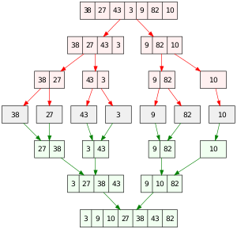

# Merge Sort

| Algorithm      | Worst time | Average time | Space |
|----------------|------------|--------------|-------|
| Merge sort	 | O(n lg n)  | O(n lg n)    | O(1)  | 

Efficient, general-purpose, comparison-based sorting algorithm. Most implementations produce a _stable sort_.

Merge sort is a _Divide-and-Conquer_ algorithm invented by John Von Neumann in 1945.

## Algorithm

1. Divide the unsorted list into `n` sublist, each containing one element (sorted).
2. Repeatedly merge sublists to produce new sorted sublists until there is one sublsit remaining.
