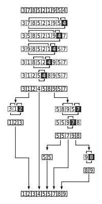

# Quick Sort

| Algorithm      | Worst time | Average time | Space |
|----------------|------------|--------------|-------|
| Quick sort     | O(n^2)     | O(n lg n)    | O(1)  |



Quicksort is often the practical choice for sorting vecause it is remarkably efficient on the average, its expected running time os `Theta(n lg n)`, and the constant factors hidden in the notation are quite small. It also has the advantage of sorting in place.

## Algorithm

Quicksort, like merge sort, applies the _Divide-and-Conquer_ paradigm.

```
Quicksort(A, p, r):
	if p < r
		q = Partition(A, p, r)
		Quicksort(A, p, q-1)
		Quicksort(A, q+1, r)

Partition(A, p, r)
	x = A[r] // pivot
	i = p-1
	for j = p to r-1
		if A[j] <= x
			i = i + 1
			exchange A[i] with A[j]
	exchange A[i+1] with A[r]
	return i+1
```

### Divide

Partition the array A[p..r] into two (possibly empty) subarrays A[p..q-1] and A[q+1..r] such that each element of A[p..q-1] is less than or equal to A[q], which is, in turn, less than or equal to each element of A[q+1..r]. Compute the index q as part of this partitioning procedure.

### Conquer

Sort the two subarrays A[p..q-1] and A[q+1..r] by recursive calls to quicksort.

### Combine

Because the subarrays are already sorted, no work is needed to combine them.The entire array A[p..r] is now sorted. 

## Performance

Running time of quicksort depends on whether the partitioning is balanced or not, which in turn depends on which elements are used for partitioning.

If partitioning is unbalanced, however, it can run asymptotically as slowly as insertion sort.

In __best-case partitioning, partition produces two subproblems, each of zie no more than `n/2`. 

In the __average-case__ behavior we can expect that all permutations of input numbers are equally liked (though in an engineering situation, we cannot always expect this assumption to hold).

## Randomized Version

We use a technique called __Random sampling__. Instead of always using `A[r]` as the pivot, we will select a randomly chosen element from the subarray `A[p..r]`. We do so by first exchanging element A[r] with an element chosen at random from A[p..r]. By randomly sampling the range p,..,r we ensure that the pivot element is equally lkely to be any of the r - p + 1 elements in the subarray, and we can expect the split of te input array to be reasonably well balanced on average.

We simply implement the swap before actually partitioning.

```
RANDOMIZED-PARTITION(A, p, r)
	i = RANDOM(p, r)
	exchange A[r] with A[i]
	return PARTITION(A, p, r)

RANDOMIZED-QUICKSORT(A, p, r)
	if p < r
		q = RANDOMIZED-PARTITION(A,p,r)
		RANDOMIZED-QUICKSORT(A,p,q-1)
		RANDOMIZED-QUICKSORT(A,q+1,r)
```
