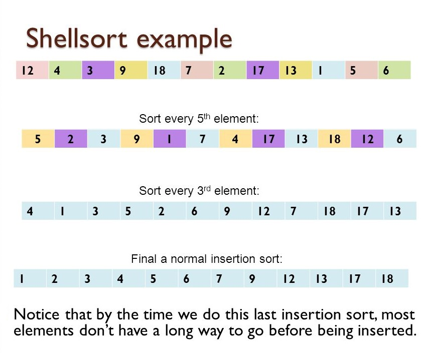

# [Shell Sort](https://en.wikipedia.org/wiki/Shellsort)




Shell's method, is an __in-place comparison sort__. Method starts by sorting pairs of element far apart from each other, then progressively reducing the gap between elements to be compared.

Starting with far apart elements, it can move some out-ofplace elements into position faster than simple nearest neighbor exchange.

The running time of Shellsort is heavily dependent on the gap sequence it uses. For many practical variants, determining their time complexity remains an open problem.

#### Worst-case performance

* O(n^2) for worst known worst case gap sequence.
* O(n log^2 n) for best known worst case gap sequence.

#### Average case performance

Depends on gap sequence.

#### Worst-case space complexity

O(n) total.


## Pseudocode

```
gaps = [701, 301, 132, 57, 23, 10, 4, 1]

# Start with the largest gap and work down to a gap of 1
foreach (gap in gaps)
{
    # Do a gapped insertion sort for this gap size.
    # The first gap elements a[0..gap-1] are already in gapped order
    # keep adding one more element until the entire array is gap sorted
    for (i = gap; i < n; i += 1)
    {
        # add a[i] to the elements that have been gap sorted
        # save a[i] in temp and make a hole at position i
        temp = a[i]
        # shift earlier gap-sorted elements up until the correct location for a[i] is found
        for (j = i; j >= gap and a[j - gap] > temp; j -= gap)
        {
            a[j] = a[j - gap]
        }
        # put temp (the original a[i]) in its correct location
        a[j] = temp
    }
}
```
