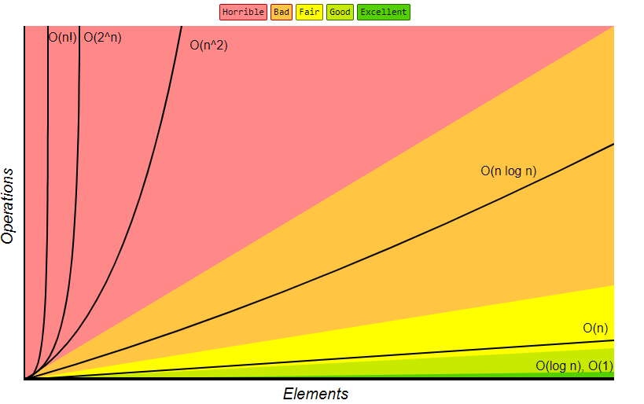

# Data Structures

|          #         | Time - Worst Case |           |           | Time Average Case |           |           | Space - Worst |
|:------------------:|:-----------------:|:---------:|:---------:|:-----------------:|:---------:|:---------:|:-------------:|
|   Data Structure   |       Search      |   Insert  |   Delete  |       Search      |   Insert  |   Delete  |       #       |
|        Array       |        O(n)       |    O(n)   |    O(n)   |        O(n)       |    O(n)   |    O(n)   |      O(n)     |
|        Stack       |        O(n)       |    O(1)   |    O(1)   |        O(n)       |    O(1)   |    O(1)   |      O(n)     |
|        Queue       |        O(n)       |    O(1)   |    O(1)   |        O(n)       |    O(1)   |    O(1)   |      O(n)     |
| Single Linked-List |        O(n)       |    O(1)   |    O(1)   |        O(n)       |    O(1)   |    O(1)   |      O(n)     |
| Double Linked-List |        O(n)       |    O(1)   |    O(1)   |        O(n)       |    O(1)   |    O(1)   |      O(n)     |
|     Hash Table     |        O(n)       |    O(n)   |    O(n)   |        O(1)       |    O(1)   |    O(1)   |  O(n log (n)) |
|         BST        |        O(n)       |    O(n)   |    O(n)   |     O(log(n))     | O(log(n)) | O(log(n)) |      O(n)     |
|         AVL        |     O(log(n))     | O(log(n)) | O(log(n)) |     O(log(n))     | O(log(n)) | O(log(n)) |      O(n)     |
|       B-Tree       |     O(log(n))     | O(log(n)) | O(log(n)) |     O(log(n))     | O(log(n)) | O(log(n)) |      O(n)     |
|   Red-Black-Tree   |     O(log(n))     | O(log(n)) | O(log(n)) |     O(log(n))     | O(log(n)) | O(log(n)) |      O(n)     |
