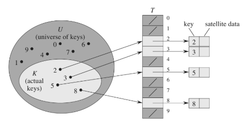
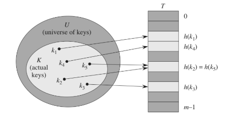
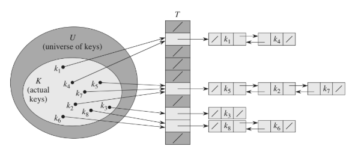

# Hash Table

A Hast Table is an effective data structure for implementin dictionaries. Although searching for an element in a hash table can take as long as searching for an element in a linked list (`Theta(n)` worst case), in practice, under reasonable assumptions, the average time to searh for an element in a hash table is `O(1)`.

A Hast Table generalizes the simpler notion of an ordinary array. Directly addressing into an ordinary array makes effective use of our ability to examine an arbitrary position in an array in O(1) time.

### Direct-address tables

Simple technique that works well when the universe U of keys is reasonbly small. Suppose that an application needs a dynamic set in which each element has a key drawn from the universe U = {0, ..., m-1}, where m is not too large.

To represent the dyamic set, we use an array, or __direct-address table__, denoted T[0,...,m-1] in which each position/slot corresponds to a key in the universe U. 



### Hash Tables to the rescue

The downside of direct addressing is that if universe U is large, storing a table of size |U| may be impractical. Furthermore, the set K of keys actually stored may be so small relative to U that most of the space allocated for T would be wasted.

With Hash Tables, we can reude the storage requirement to `Theta(|k|)` while we maintain the benefit that searching for an element in the hash table still requires only `O(1)` time. 

> The catch is that this bound is for the average-case time, whereas for direct addressing it holds for the worst-case time. 

With direct addressing, an element with key k is stored in slot k, but with hashing, this element is stored in slot `h(k)`, that is, we use a __hash function__ h to compute the slot from the key . 





Here `h` function maps the universe _U_ of keys into the slots of a hash table T[0..,m-1]:

```
h: U -> {0,1,...,m-1}
```

### Collisions

Two keys may hash to the same slot. We call this situation a collision.

The ideal solution would be to avoid colisions altogether. We might try to achieve this goal by choosing a suitable hash function `h`. One idea is to make `h` appear to be "random", thus avoiding collisinos or at least minimizing their number. Of course, a hash function `h` must be deterministic in that a given input k shold always produce he same output `h(k)`.

However avoiding collisions altogether is impossible (`|U| > m`). Thus, while a well-designed, "random"-looking hash function can minimize the number of collisions, we stil need a method for resolving the collisions that do occur. 

#### Algorithms for solving collisions

_Check algorithms section for hashing related algorithms_.

