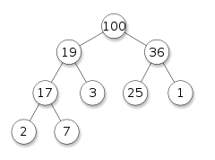

# [Heap](https://en.wikipedia.org/wiki/Heap_(data_structure))

A Heap is a specialized tree-base data structure which is essentially an almost complete tree that satisfies the __Heap Property__.

The (binary) heap data structure is usually an array object that can be seen as a nearly complete binary tree. Each node of the tree corresponds to an element of the array.

The tree is completely filled on all levels, except possible the lowest, which is filed from left up to a point.



However, a heap is not a sorted structure. It can be regarded as being partially ordered. A heap is useful when it is necessary to repeatedly remove the object with the highest/lowest priority (great for priority queues).

Heaps are also crucial in several efficient graph algorithms such as Dijkstra's algorithm. When a heap is a complete binary tree, it has a smallest possible height (log n).

## Types and Heap Property

There are two kinds of binary heaps: _Max Heaps_ and _Min Heaps_. In both kinds, the values in the nodes satisfy a __Heap Property__, and the specifics of which depend on the kind of heap.

Max Heap is usually used for Heap Sort, whereas Min Heaps commonly implement priority queues.

In a Max Heap, for any given node C, if P es parent node of C, then the key (value) of P is greater than or equal to the key of C. In a Min Heap, the inversal statement holds true.

```
// max heap
A[PARENT(i)] >= A[i]

// min heap
A[PARENT(i)] <= A[i]
```

## Implementation

Heaps are usually implemented with an implicit heap data structure, consisting of an array (fixed or dynamic) where each element represents a tree node whose parent/children relationship is defined implicitly by their index.

After an element is inserted into or deleted from a heap, the heap property may be violated and the heap must be balanced by swappign elements within the array.

An array A that represents a heap has two attributes `A.length` which gives number of elements in the array and `A.heap-size` which represents how many elements in the heap are stored within array A.

## Performance

Since a heap of n elements is based on a complete binary tree, its height is `Theta(lg n)`. Basic operations on heaps run in time at most proportional to the heigh of the tree and thus take `O(lg n)` time.

### Max-Heapify `O(lg n)`

> Key to maintaining the Max Heap Property.

When called, it assumes that the binary trees rooted at `LEFT(i)` and `RIGHT(i)` are Max Heaps but that `A[i]` might be smaller than its children, thus violating the Max Heap Property.

Max-Heapify lets the value at `A[i]` 'float down' in the Max Heap so that the subtree rooted at index `i` obeys the Max Heap Property.

```python
Max-Heapify(A, i):
	l = LEFT(i)
	r = RIGHT(i)
	if l <= A.heap-size and A[l] > A[i]
		largest = l
	else largest = i
	if r <= A.heap-size and A[r] > A[largest]
		largest = r
	if largest != i
		exchange A[i] with A[largest]
		Max-Heapify(A.largest)
```

We can characterize the running time of Max-Heapify on a node of height `h` as `O(h)`, which can be generalized as O(lg n).

### Build-Max-Heap `O(n)`

Produces a Max Heap from an unordered input array.

```python
Build-Max-Heap(A):
	A.heap-size = A.length
	for i = [A.length // 2] downto 1
		Max-Heapify(A.i)
```

### Others `O(lg n)`

Allow the Heap data structure to implement a priority queue:

* Max-Heap-Insert
* Heap-Increase-Key
* Heap-Extract-Max
* Heap-Maximum

```python
Max-Heap-Insert(A, key):
	A.heap-size = A.heap-size + 1
	A[A.heap-size] = -infinity
	Heap-Increase-Key(A, A.heap-size, key)
```

```python
Heap-Increase-Key(A, i, key):
	if key < A[i]:
		error "new key is smaller than current key"
	A[i] = key
	while i > 1 and A[PARENT(i)] < A[i]
		exchange A[i] with A[PARENT(i)]
		i = PARENT(i)
```

```python
Heap-Extract-Max(A):
	if A.heap-size < 1:
		error "heap underflow"
	max = A[1]
	A[1] = A[A.heap-size]
	A.heap-size = A.heap-size - 1
	Max-Heapify(A, 1)
	return max
```

```python
Heap-Maximum(A):
	return A[1]
```

## Implicit Heap Structure

Fist (or last) element will contain the root. Next two element contain its children. Next four element contain the four children of the two child nodes, etc...

Thus the childre of the node at position n, would be positions 2n and 2n+1, or in a zero-based array 2n+1 and 2n+2.

Computing the index of the parent node of n-th element is also straightforward (n/2).


```javascript
Parent = (i) => Math.floor(i / 2)
Left = (i) => 2 * i + 1
Right = (i) => 2 * i + 2
```