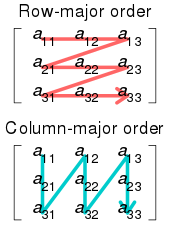
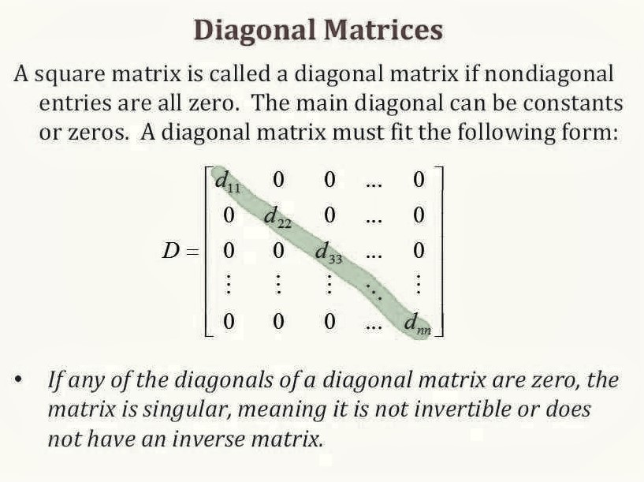
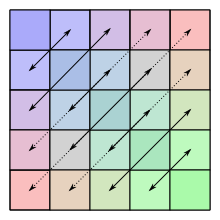
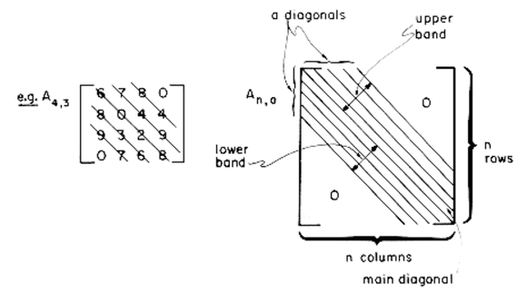
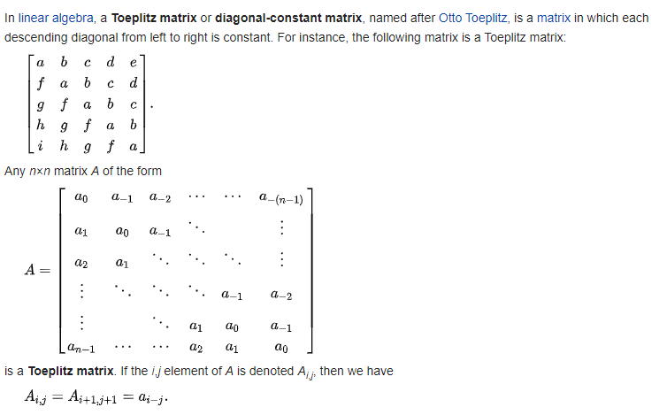
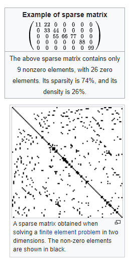

# Matrix

* Diagonal
* Lower Triangular
* Upper Triangular
* Symmetric
* Tri-Diagonal
* Square Band
* Toeplitz
* Sparse

## Representation

There are two common ways to store a Matrix (multidemnsional arrays) in linear storage such as _random access memory_. 

#### [Row- and Column-Major Order](https://en.wikipedia.org/wiki/Row-_and_column-major_order)

The main idea behind those is using only an Array, without nested arrays, and taking advantage of two concepts:

* Matrix-Row-Major Mapping
* Matrix Column-Major Mapping



The difference between the order lies in which elements of an array are contiguous in memory. In row-major orden, the consecutive elements of a row reside next to each other, whereas the same holds true for consecutive elements of a column in column-major oder.


#### Diagonal Matrix

```
M[i, j] = 0 if i != j
```



#### Lower & Upper Triangular Matrix


#### Symmetric Matrix



Can be represented using whether a lower-triangular or upper-triangular.

#### Tri-diagonal Matrix


* Main Diagonal: `i-j=0`
* Lower Diagonal: `i-j=1`
* Upper Diagonal: `i-j`=-1

```
M[i,j] = non-zero if |i - j| <= 1
M[i,j] = 0 if |i - j| > 1
```

* If i-j=1 -> index = i-1
* If i-j=0 -> index = n-1 + i-1
* if i-j=-1 -> index = 2n-1+i-1

#### Square Band Matrix



#### [Toeplitz Matrix](https://en.wikipedia.org/wiki/Toeplitz_matrix)




```
M[i,j] = M[i-1, j-1]

Index(A[i][j]):
	if i <= j then index = j - 1
	if i > j then index = n + i -j - 1
```

#### [Sparse Matrix](https://en.wikipedia.org/wiki/Sparse_matrix)

> A matrix in which most of the elements are zero.



* 3-column representation
* Compressed sparse rows

