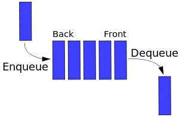

# Queue (LIFO)

A _queue_ is a collection of entities that are maintained in a sequence and can be modified by the addition of entities at one end of the sequence and the rmeoval of entities from the other end.

By convention, the end of the sequence at which elements are adedd, isc alled te __back/tail/rear__ of the queue.

While the end at which elements are removed is called the __head/front__ of the queue.

This convention is analogously to the words used when people line up o wait for goods or services.

## Operations

#### enqueue

Operation of __adding__ an element to the tail of the queue.

#### dequeue

Operation of __removing__ an element from the head of the queue.

#### Others

Other operations may als obe alwod, often including a `peek` or `front` operation that returns the vaue of the next element to be dequeued without dequeuing it.

## FIFO

Operations of a queue make it a __firstin-first-out__ data structure. First element added to the queue will be the first noe to be removed.

This is equivalent to the requirement that once a new elemnt is added, all the elements thatare added before have to be removed before the new element can be removed.

## Usages

Common implementations are __circular buffers__ and __linked lists__.

Queues are usefull to store events that ar eheld to be rpocessed later. In these contexts, the queue performs the function of a __buffer__.

Another usage of queues is in the implementaion of __breadth-first search__.

## [Priority Queues](https://en.wikipedia.org/wiki/Priority_queue)

A priority queue is like a regualr queue or stack data structure, but where additionally each element has "priority" associated with it.

In a priority queue, an element with high priority is served before an element with low riority.

While priority queues are often implemented with heaps, they are conceptually distint from heap. Priority queue is a concept like a "list" or a "map", that can be implemented with a linked list or an array.
