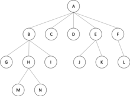

# Trees

> Tree is a collection of nodes and edges. There are (nodes - 1) edges.

A tree data strucure can be __defined recursively__ as a collection of nodes (starting at a root node), where each node is a data structure consisting of a value, together with a list of references to nodes (the "children"), with te constraints that no reference is duplicated, and none points to the root.

Alternatively, a tree can be __defined abstractly__ as a whole as an ordered tree, with a value assigned to each node.

### Common Operations

#### Insertion

Nodes can be inserted into binary trees in between two other nodes, or added
after a leaf node. In biary trees, a node that is inserted is specified as to which child it is.

To __add a new node after leaf node `A`__, `A` assigns the new node as one of its children and the new node asigns node A as its parent.

To __add on internal nodes__ is more complex.

#### Deletion

Nodes with zero or one children can be removed unambiguously.

In a binary tree, a node with two hldren cannot be deleted unambiguously. However, in certain binary trees (including _binary search trees__) these nodes can be deleted, though with a rearrangement of the tree data structure.

#### Traversal

Visit each node in a tree by _recursively visiting_ each node in the left and right subtrees of the root.

* Pre-order
* In-order
* Post-order
* Depth-first order
* Breadth-first order

#### Depth-first order

We attempt to visit the node farthest from the root that we can, but with the caveat that it must be a child of a node we have already visited. Unlike a depth-first search on graphs, tere is no need to remember all the nodes we have visited, because a tree cannot contain cycles. Pre-order is a special case of this.

#### Breadth-first-order

We attempt to visit the node closest from the root that it has not already been visited.

### Common Types

* AVL
* Binary Tree
* Huffman tree
* K-ary tree
* Random binary tree
* Red-black tree
* Optimal binary search tree
* Self-balancing binary search tree

---

## Binary Tree

Tree data structure in which each node has _at most two children_.

A recursive definition using just set theory notions is that a non-empty binary tree is a tuple `(L, S, R)` where `L` and `R` are binary trees or the empty set, and S is a singleton set.

#### Usage

* Means for accesing nodes based on some value/label associated with each node.
* Binary search trees and binary heaps (efficient searching and sorting).
* Representation of dta with a relevant bifurcating structure (common exaples occur with Huffman coding and cladograms).

#### Types of Binary Trees

Tree terminology is not well-standardized and so varies in the literature.

1. __Rooted__ bt, has a root node and every node at most two children.

2. __Full/Strict__ bt, every node has 0 or 2 children.

3. __Complete__ bt, every level except psosible the last, is completely filled, and all nodes in the last level are as far left as possible.

4. __Perfect__ bt, all interior nodes have two children and all leaves have the same depth or same level.

5. __Infinite complete__ bt, every node has two children, and so the set of levels is countably infinite.

6. __Balanced__ bt, left and right subtrees of every node differ in height by no more than 1.

7. __Degenerate__ bt, each parent node has only one associated child node. This mean that the tree will behave like a linked list data structure.

#### Properties of Binary Trees

* Number of nodes `n` in a __full binary__ tree, is at least `n = 2h + 1` and at most `n = 2^(h+1) - 1`.
* Number of leaf nodes `l` in a __perfect__ binary tree is `l = (n+1) / 2`.
* Number of nodes in a __perfect__ binary tree is `2l - 1`.
* In a __balanced full__ binary tree, `h = |log_2 (n+1)|`.
* In a __perfect__ full binaryt ree, `l = 2^h` and thus `n = 2^(h+1) - 2`.
* Number of null links in a binary tree of `n` nodes is `(n+1)`.
* Number of internal nodes in a __complete__ binary tre of n nodes is `|n / 2|`.
* For any non-empty binary tree with `n_0` leaf nodes and `n_2` nodes of degree 2, `n0 = n2 + 1`.

---

## [K-Ary Trees](https://en.wikipedia.org/wiki/M-ary_tree)

In _graph teory_, k-ary tree is a rooted tree in which each node has __no more than k children__.

> Binary Tree is a special case where `k=2`.

#### Types of K-Ary Trees

* __Full/Strict__ k-ary tree, within each level every node has either 0 or k children.
* __Complete__ k-ary tree, is maximally space efficient. It must be completely filled on every level except possibly for the last one, in which case all nodes of the tree must be as far left as possible.
* __Perfect__ k-ary tree is a full k-ary tree in which all leaf nodes are at the same depth. 

#### Properties of K-Ary Tres

* Total number of possible k-ary trees with `n` nodes can be calculated with [Catalan Number](https://en.wikipedia.org/wiki/Catalan_number).
* Height of a complete k-ary tree with n nodes is `|log_m ((m-1) * n)|`.
