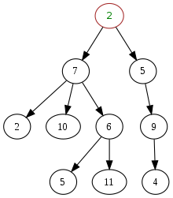

# Trees

> Tree is a collection of nodes and edges. There are (nodes - 1) edges.

A tree data strucure can be __defined recursively__ as a collection of nodes (starting at a root node) that have a __parent-child__ relationship, where each node is a data structure consisting of a value, together with a list of references to nodes (the "children"), with the constraints that no reference is duplicated, and none points to the root.

Alternatively, a tree can be __defined abstractly__ as a data type that stores elmenets hierarchically.

## Common Operations

### Insertion

Nodes can be inserted into binary trees in between two other nodes, or added
after a leaf node. In biary trees, a node that is inserted is specified as to which child it is.

To __add a new node after leaf node `A`__, `A` assigns the new node as one of its children and the new node asigns node A as its parent.

To __add on internal nodes__ is more complex.

### Deletion

Nodes with zero or one children can be removed unambiguously.

In a binary tree, a node with two hldren cannot be deleted unambiguously. However, in certain binary trees (including _binary search trees__) these nodes can be deleted, though with a rearrangement of the tree data structure.

### Traversal

Systematic way of accessing, or 'visiting', all the positions of a tree `T`. The specific action associated with the 'visit' of a position, depends on the application of this traversal.

* Pre-order
* In-order
* Post-order
* Depth-first order
* Breadth-first order

## Common Types

* [Binary Tree](bt/README.md)
* [Binary Search Tree (BST)](search/bst/README.md)
* [K-ary tree](kary/README.md)
* [AVL](/avl/README.md)
* Search trees
	* [B-Trees](/search/btree/README.md)
		* [2-3](/search/btree/2-3/README.md)
		* [2-3-4](/search/btree/2-3-4/README.md)
	* [Red-Black](/search/red-black/README.md)
* Huffman tree
* Random binary tree
* Optimal binary search tree
* Self-balancing binary search tree

---
