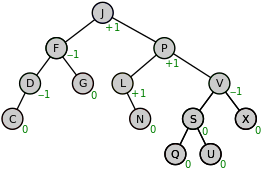
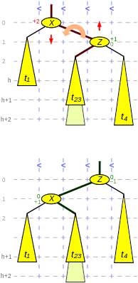
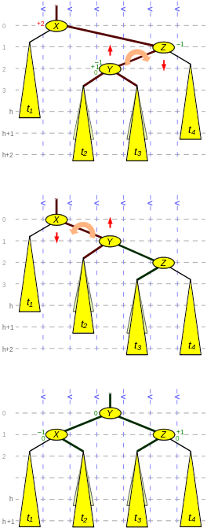

# AVL (Adelson-Velsky Landis)

AVL is a __self-balancing BST__. The heights of the two child subtrees of any node differ by at most one, if at any time they differ by more than one, rebalancing is done to restore this propery.

__Lookup, insertion and deletion__ all take __O(log n)__ time in both the average and worst cases, where _n_ is then umber of node in the tree prior to the operation. Insertions and delations may require te tree to be realanced by one or more __tree rotations__.




### Balance Factor

Balance factor of a node `N` is defined to be the height difference:

```
BalanceFactor(N) = Height(RightSubtree(N)) - Height(LeftSubtree(N))
```

And a binary tree is defined to be an AVL tree if for every node N in the tree the following invariant holds:

```
BalanceFactor(N) in {-1, 0, 1}
```

### Height

The height _h_ (counted as number of edges on the longest path) of an AVL tree with _n_ nodes lies in the interval.

```
log_2(n+1) - 1 <= h < c.log_2(n+2) + b

b = 1/log_2(phi)
c = c/2 * log_2(5-3)
```

### Rebalancing

If during a modifying operation, a temporary height difference of more than one arises between two child subtrees, the parent subtree has to be rebalanced. The given reapir tools are so called __tree rotations__, because they move the keys only "vertically", so that the "horizontal" in order sequence of te keys is fully preserved (essential for a binary-search tree).

#### Simple Rotaton



#### Double Rotation


