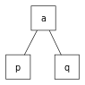
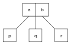
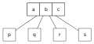

# [2-3-4 Trees](https://en.wikipedia.org/wiki/2%E2%80%933%E2%80%934_tree)

A 2-3-4 tree, also called 2-4 tree, is a self-balancing tree (B-tree) commonly used to implement dictionaries.

Every internal node has either two, three, or four child nodes.

* a 2-node has one data element, and if internal has two child nodes.
* a 3-node has two data elements, and if internal has three child nodes.
* a 4-node has three data elements and if internal has four child nodes.

