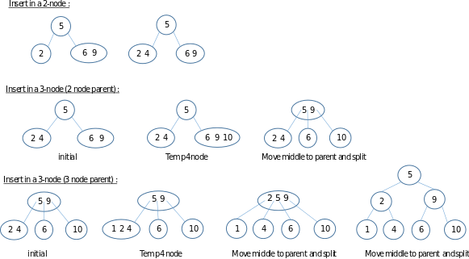

# [2-3 Tree](https://en.wikipedia.org/wiki/2%E2%80%933_tree)

Multiway search tree of degree 3, every node with children has either two children and one data element or three children and two data elements.

2-3 trees are balanced, maning that each right, center and left subtree contains the same or close to the same amount of data.

#### 2-node

#### 3-node

### Properies

* Every internal onde is a 2-node or a 3-node.
* All leaves are at the same level.
* All data is kept in sorted order.

### Insertion

