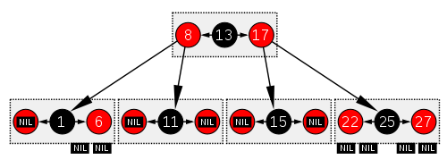

# [Red-black tree](https://en.wikipedia.org/wiki/Red%E2%80%93black_tree)

A __Red-black tree__ is a kind of self-balancing binary search tree.

Each node has an extra bit, often interpreted as the color (red|black). These color bits are used to ensure the tree remains approximately balanced during insertions and deletions.

#### Self-balancing method

Balance is preserved by painting each node of te tree with one of twoc olors in a way that satisfies certain prperties, which colectively constrain how unbalanced the tree can become in the worst case. When the tree is modfied, the new tree is subsequently rearanged and repainetd to restore the coloring properties. The properties are designed in such a way that this rearranging and recoloring can be performed efficiently.

The balancing of the tree is good enough to guarantee __searching in O(log n)__. Insertion and deletion, along with the tree rearrangement and recoloring, are also performed in O(log n) time.

### Properties

In addition to the requirements imposed on a BST:

* Each node is either red or black.
* Root is black.
* All leaves (NIL) are black.
* If a node is red, then both its children are black.
* Every path from a given node to any descendant NIL goes through the same number of black nodes.

### Analogy to B-Trees of order 4

Red-black tree is structurally equivalent to a B-tree of order 4, but B-tree is more general, multiple red-black trees can be produced from an equivalent B-tree of order 4.
